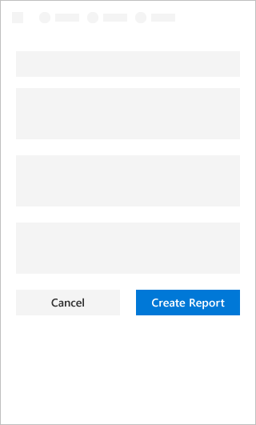
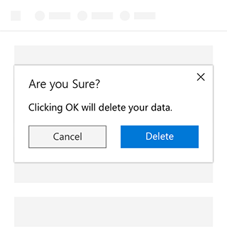
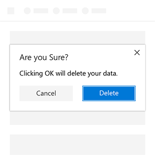
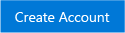
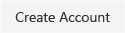
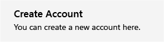

# Buttons Component in Office UI Fabric

Buttons are best used to enable a user to commit a change or complete steps in a task. The text of a button should communicate the intent of the interaction. Therefore, as a guiding pattern for add-ins, buttons are placed at the bottom of the UI container of a task pane, dialogs, or content pane.

For example, use buttons at the end of a form to submit it; to close the end of a dialog, or move to the next settings screen to commit changes.
  
#### Example: Buttons on a task pane

## Best Practices

<table>
    <tr>
        <th>Do</th>
        <th>Don't</th>
    </tr>
    <tr>
        <td>Default buttons should always perform safe operations in Add-in.</td>
        <td>Don’t place the default focus on a button that destroys data. Instead, place it on the button that performs the “safe act” and retains the content or cancels the action.</td>
    </tr>
    <tr>
        <td></td>
        <td></td>
    </tr>
</table>

<table>
    <tr>
        <th>Do</th>
        <th>Don't</th>
    </tr>
    <tr>
        <td>Use only a single line of text in the label of the button.</td>
        <td>Don’t put too much text in a button – try keep text to a minimum.</td>
    </tr>
    <tr>
        <td>· Make sure the label conveys a clear purpose of the button to the user. Use concise, specific, self-explanatory labels, usually a single word.</td>
        <td>Don’t use a button to navigate to another place apart from “Back” and “Next” buttons, use a link instead.</td>
    </tr>
    <tr>
        <td>Expose only one or two buttons to the user at a time. For example, “Accept” and “Cancel”. If you need to expose more actions to the user, consider using checkboxes or radio buttons from which the user can select actions, with a single command button to trigger those actions.</td>
        <td>Don’t put anything other than text in a button.</td>
    </tr>
    <tr>
        <td>“Submit”, “OK”, and “Apply” buttons should always be styled as primary buttons. When “Reset” or “Cancel” buttons appear alongside one of the above, they should be styled as default buttons.</td>
        <td></td>
    </tr>
</table>

## Variants

<table>
    <tr>
        <th>Variation</th>
        <th>Description</th>
        <th>Example</th>
    </tr>
    <tr>
        <td>Primary Button</td>
        <td>Inherits theme color at rest state. Use this as the main call to action.</td>
        <td></td>
    </tr>
    <tr>
        <td>Default button</td>
        <td>Default button should always perform safe operations and should never delete.</td>
        <td></td>
    </tr>
    <tr>
        <td>Compound Button</td>
        <td>Used to cause actions that complete a task or cause a transitional task.</td>
        <td></td>
    </tr>
</table>

## Implementation

For details, see [Button](https://dev.office.com/fabric#/components/button) on the Office UI Fabric website.

## Additional Resources
* [UX Pattern Sample](https://office.visualstudio.com/DefaultCollection/OC/_git/GettingStarted-FabricReact)
* [GitHub Development Resources](https://github.com/OfficeDev/Office-Add-in-UX-Design-Patterns-Code)