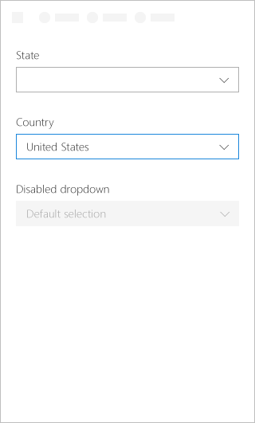
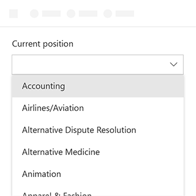
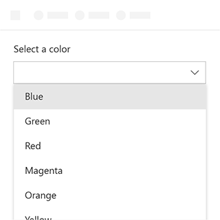

# Dropdown Component in Office UI Fabric

A Dropdown is a list which reveals selected items by clicking a drop-down button. It is used to simplify the design and make a choice within the UI. The selected item is visible when the list is collapse. To change the value, users open the list, navigate through the list and select a new value.
  
#### Example: Dropdown on a task pane

## Best Practices

|**Do**|**Don't**|
|:------------|:--------------|
|Use a Dropdown when the selected option is more likely than the alternatives (in contrast to radio buttons where all the choices are visible putting more emphasis on the other options).|Don't use dropdowns when additional options are equally likely.|
|||

|**Do**|**Don't**|
|:------------|:--------------|
|Use a Dropdown when there are multiple choices that can be collapsed under one title. Or if the list of items is long or when space is constrained.|Don’t use Dropdown if there are fewer than two choices. Use a checkbox instead.|
|Dropdowns should contain shortened statements or words.| |

## Variants

|**Variation**|**Description**|**Example**|
|:------------|:--------------|:----------|
|**Basic uncontrolled Dropdown**|Needs description||
|**Disabled uncontrolled Dropdown with defaultSelectedKey**|Needs description||
|**Controlled Dropdown**|Needs description||

## Implementation

For details, see [Dropdown](https://dev.office.com/fabric#/components/dropdown) on the Office UI Fabric website.

## Additional Resources
* [UX Pattern Sample](https://office.visualstudio.com/DefaultCollection/OC/_git/GettingStarted-FabricReact)
* [GitHub Development Resources](https://github.com/OfficeDev/Office-Add-in-UX-Design-Patterns-Code)