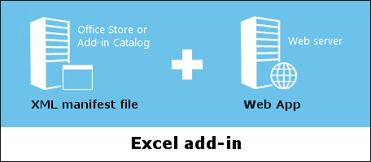

# Core concepts

An Excel add-in consists of two main components: an XML manifest file and a web app.

Script Lab?

## JavaScript APIs

Office.js 

* common APIs versus shared APIs
* office versions
* requirement sets -- what they are, why they matter, checking for supportability in JS code
* open specifications page

An Excel add-in interacts with objects in Excel by using the [JavaScript API for Office](../../reference/add-ins/javascript-api-for-office.md?product=excel), which includes two JavaScript object models:

1. **Common APIs**: APIs that were introduced with Office 2013 and are broadly useful across multiple types of host applications such as Word, Excel, PowerPoint, etc. This object model uses callbacks extensively. If your add-in targets Excel 2013 and later, you'll need to use the Common APIs.

2. **Host-specific APIs**: APIs that were introduced with Office 2016 and provide strongly-typed objects that correspond to specific host applications such as Excel. The [Excel JavaScript API](../../reference/excel/excel-add-ins-reference-overview.md?product=excel) uses promises and provides access to Excel-specific objects such as worksheets, ranges, tables, charts. The host-specific APIs represent the future of Office JavaScript APIs, so you should use the Excel JavaScript API whenever feasible.  

### Supported platforms

Excel add-ins are supported across multiple versions of Office, including Office 2013 for Windows, Office 2016 for Windows, Office for iPad, Office for Mac, and Office Online. Not all features are available on all platforms. To learn which Excel add-in features and [requirement sets](../../reference/add-ins/requirement-sets/excel-api-requirement-sets.md?product=excel) are supported by each platform, see [Office Add-in host and platform availability](https://dev.office.com/add-in-availability).

---

The web app uses the [JavaScript API for Office](../../reference/add-ins/javascript-api-for-office.md?product=excel) to interact with objects in Excel and can also facilitate the user's interaction with online resources. For example, an add-in may do things such as:

* Create, read, update, and delete data in the workbook (worksheets, ranges, tables, charts, named items, and more).
* Facilitate a user's authentication with an online service by using the standard OAuth 2.0 flow.
* Issue API requests to Microsoft Graph and/or other APIs.

The app can be hosted on any web server and can be built using any server-side technology that your hosting provider supports, such as ASP.NET, Node.js, PHP, Python, etc. Likewise, you can use any client-side framework for the web app, such as Angular, React, jQuery, etc., or even just VanillaJS.

## Manifest

describe what manifest controls -- include details (and links out to relevant content) for: 

* define add-in commands 
* specify office hosts
* specify permissions
* ...

The [XML manifest file](../overview/add-in-manifests.md?product=excel) defines an Excel add-in's settings and capabilities such as: 

* The add-in's display name, description, ID, version, and default locale.
* How the add-in integrates with Excel, including any custom UI that the add-in creates (ribbon buttons, etc.).
* The permissions that the add-in requires, such as reading and writing to the document.
* The location of the add-in's web app.

## Lifecycle of an add-in

> See: https://dev.office.com/docs/add-ins/develop/add-in-development-lifecycle

### Design

* design and implement the UI/UX
* link to: [Design your Office Add-ins](../design/add-in-design.md?product=excel)

### Develop 

* ...

### Test and debug

Test:
* sideloading an add-in for testing (3 ways?)

Debug:
* attach debugger from task pane
* debug (3 ways)
* validate and troubleshoot issues with your manifest

### Publish

* publish web app:  host on Azure or elsewhere
* publish manifest: via centralized deployment | to add-in catalog | to the Office Store (include link to validation policies)

### Maintain

* ...

## Next steps

programming overview

## Additional resources

* ...