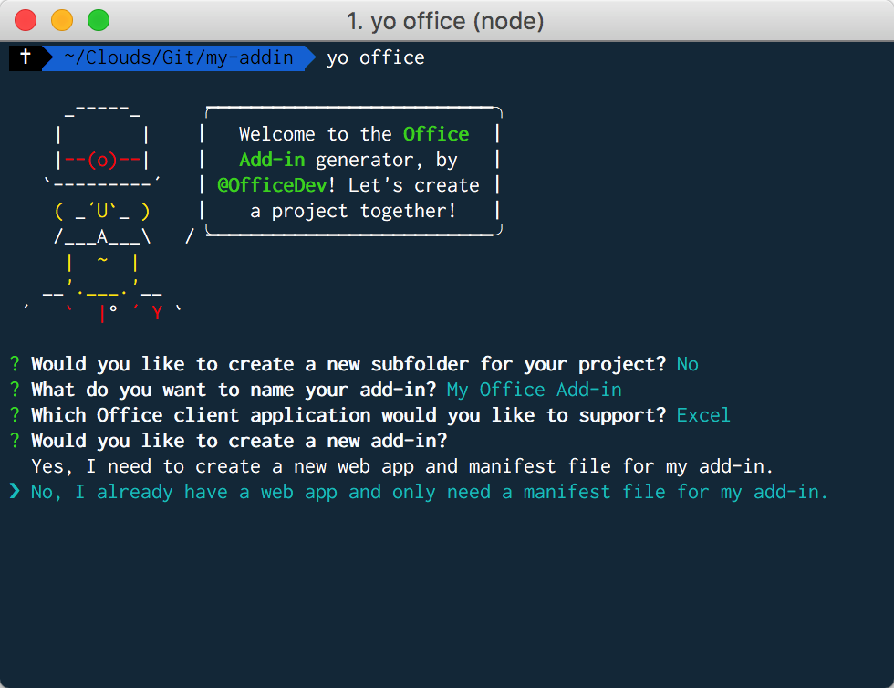

# Build an Excel add-in using Angular

This article walks you through the process of building an Excel add-in by using Angular and the Excel JavaScipt API.

## Prerequisites

Get started by completing the following prerequisite tasks:

1. Check whether you already have the [Angular CLI prerequisites](https://github.com/angular/angular-cli#prerequisites) and install any prerequistes that you are missing.

2. If you haven't done so previously, install the [Angular CLI](https://github.com/angular/angular-cli) globally. 
```bash
npm install -g @angular/cli
```

3. If you haven't done so previously, install [Yeoman](https://github.com/yeoman/yo) and the [Yeoman generator for Office Add-ins](https://github.com/OfficeDev/generator-office) globally.
```bash
npm install -g yo generator-office
```

## Generate a new Angular app

Use the Angular CLI to generate your Angular app by running the following command.

```bash
ng new my-addin
```

## Generate the manifest file and sideload the add-in

An add-in's manifest file defines its settings and capabilities.

1. Navigate to your app folder.
```bash
cd my-addin
```

2. Use the Yeoman generator to generate the manifest file for your add-in by running the following command and then answering the prompts as shown in the screenshot below.
```bash
yo office
```

>**Note**: If you are prompted to overwrite **package.json**, answer **No** (do not overwrite).

3. Open the manifest file (i.e., the file in the root directory of your app with a name ending in "manifest.xml"). Replace all occurrences of `https://localhost:3000` with `http://localhost:4200` and save your changes.
>**Note**: Be sure to change the protocol to **http** in addition to changing the port number to **4200**.

4. Sideload the add-in within Excel by following the instructions for the platform you'll be using to run your add-in.
    - Windows: [Sideload Office Add-ins for testing on Windows](../testing/create-a-network-shared-folder-catalog-for-task-pane-and-content-add-ins.md)
    - Excel Online: [Sideload Office Add-ins in Office Online](../testing/sideload-office-add-ins-for-testing.md#sideload-an-office-add-in-on-office-online.md)
    - iPad and Mac: [Sideload Office Add-ins on iPad and Mac](../testing/sideload-an-office-add-in-on-ipad-and-mac.md)

## Update the app: Initialize

1. Open **src/index.html**, add the following `<script>` tag immediately before the `</head>` tag, and save your change.
```html
<script src="https://appsforoffice.microsoft.com/lib/beta/hosted/office.debug.js"></script>
```

2. Open **src/main.ts**, replace `platformBrowserDynamic().bootstrapModule(AppModule);` with the following code, and save your change. 
```typescript
declare const Office: any;

Office.initialize = () => {
  platformBrowserDynamic().bootstrapModule(AppModule);
};
```


## Update the app: Add "Color Me" functionality 

1. Open **src/app/app.component.html**, replace file contents with the following single element, and save your changes. 
```html
<button (click)="onColorMe()">Color Me</button>
```

2. Open **src/app/app.component.ts**, replace file contents with the following code, and save your changes. 
```typescript
import { Component } from '@angular/core';

declare const Excel: any;

@Component({
  selector: 'app-root',
  templateUrl: './app.component.html',
  styleUrls: ['./app.component.css']
})
export class AppComponent {
  onColorMe() {
    Excel.run(async (context) => {
      const range = context.workbook.getSelectedRange();
      range.format.fill.color = 'green';
      await context.sync();
    });
  }
}
```


## Try it out

1. Start the dev server by running one of the following commands via the terminal.
```bash
npm start
```
or
```bash
ng serve
```

2. In Excel, on the **Home** tab, choose the **Show Taskpane** button in the ribbon to open the add-in task pane. Choose the **Color Me** button in the task pane to change the background color of the selected range to green.

## Next steps

Congratulations, you've successfully created an Excel add-in using Angular! Next, check out [Core concepts](excel-add-ins-core-concepts.md?product=excel) to learn more about the fundamentals of building Excel add-ins.
