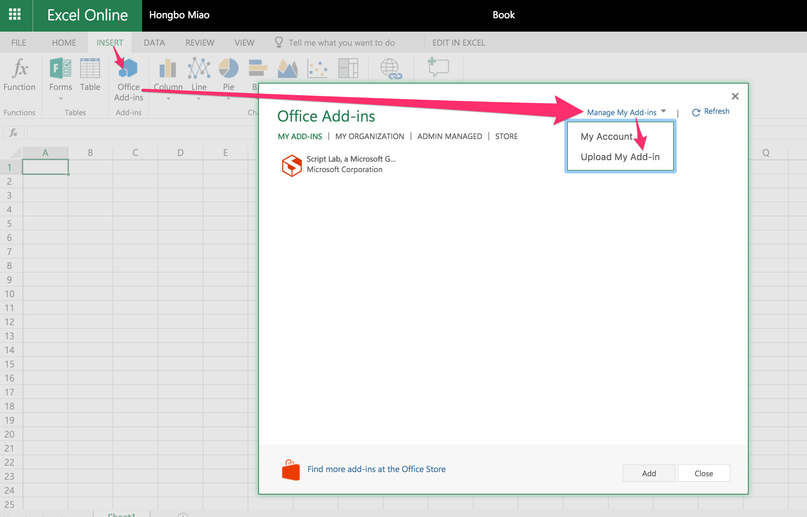

# Create an Excel add-in using Angular

## Step 1. Generate the Angular project by **Angular CLI**

If you never install [Angular CLI](https://github.com/angular/angular-cli) before, first install it globally.

```bash
npm install -g @angular/cli
```

Then generate your Angular app by

```bash
ng new my-addin
```

## Step 2. Generate the manifest file by **YO Office**.

If you never install [Yeoman](https://github.com/yeoman/yo) and [YO Office](https://github.com/OfficeDev/generator-office) before, first install them globally.

```bash
npm install -g yo generator-office
```

Go to your app folder.

```bash
cd my-addin
```

Generate the manifest file following the steps in the screenshot below.

```bash
yo office
```


You should be able to see your manifest file with the name ends with **manifest.xml**.

Open it and replace all the ports in the generated manifest file from `3000` to `4200`.

To run the add-in, you need side-load the add-in within the Excel application. Follow the way below to side-load the manifest file:

* Windows

  Follow [this tutorial](https://dev.office.com/docs/add-ins/testing/create-a-network-shared-folder-catalog-for-task-pane-and-content-add-ins).

* macOS

  Move the manifest file to the folder `/Users/{username}/Library/Containers/com.microsoft.Excel/Data/Documents/wef` \(if the folder does not exist, create one\)

* Excel Online

  Click **Upload My Add-in** button to upload the manifest file.

  

## Step 3. Initialize

Open **src/index.html**, add

```html
<script src="https://appsforoffice.microsoft.com/lib/beta/hosted/office.debug.js"></script>
```

before `</head>` tag.

Open **src/main.ts**, add `Office.initialize` out of `platformBrowserDynamic().bootstrapModule(AppModule);` like below:

```typescript
declare const Office: any;

Office.initialize = () => {
  platformBrowserDynamic().bootstrapModule(AppModule);
};
```

## Step 4. Add "Color Me"

Open **src/app/app.component.html**. Replace by

```html
<button (click)="onColorMe()">Color Me</button>
```

Open **src/app/app.component.ts**. Replace by

```typescript
import { Component } from '@angular/core';

declare const Excel: any;

@Component({
  selector: 'app-root',
  templateUrl: './app.component.html',
  styleUrls: ['./app.component.css']
})
export class AppComponent {
  onColorMe() {
    Excel.run(async (context) => {
      const range = context.workbook.getSelectedRange();
      range.format.fill.color = 'green';
      await context.sync();
    });
  }
}
```

## Step 5. Run

Run the dev server through the terminal.

```bash
npm start
```

or

```bash
ng serve
```

Open Excel and click your add-in to load.

Congratulations you just finish your first Angular add-in for Excel!

