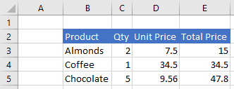
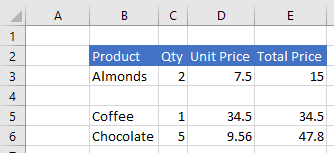
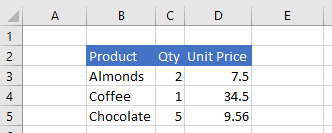
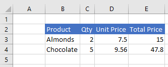
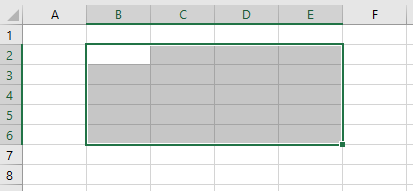

# Work with Ranges using the Excel JavaScript API

This article provides code samples that show how to perform common tasks with ranges using the Excel JavaScript API. For the complete list of properties and methods that the the **Range** object supports, see [Range Object (JavaScript API for Excel)](../../reference/excel/range.md).

## Get a range

These examples show different ways to get a reference to a range within a worksheet.

### Get range by address

The following code sample gets the range with address **B2:B5** from the worksheet named **Sample**, loads its **address** property, and writes a message to the console.

```js
Excel.run(function (context) {
    var sheet = context.workbook.worksheets.getItem("Sample");
    var range = sheet.getRange("B2:C5");
    range.load("address");

    return context.sync()
        .then(function () {
            console.log(`The address of the range B2:C5 is "${range.address}"`);
        });
});
```

### Get range by name

The following code sample gets the range named **MyRange** from the worksheet named **Sample**, loads its **address** property, and writes a message to the console.

```js
Excel.run(function (context) {
    var sheet = context.workbook.worksheets.getItem("Sample");
    var range = sheet.getRange("MyRange");
    range.load("address");

    return context.sync()
        .then(function () {
            console.log(`The address of the range "MyRange" is "${range.address}"`);
        });
});
```

### Get used range

The following code sample gets the used range from the worksheet named **Sample**, loads its **address** property, and writes a message to the console. The used range is the smallest range that encompasses any cells in the worksheet that have a value or formatting assigned to them. If the entire worksheet is blank, the **getUsedRange()** method will return a range that consists of only the top-left cell in the worksheet.

```js
Excel.run(function (context) {
    var sheet = context.workbook.worksheets.getItem("Sample");
    var range = sheet.getUsedRange();
    range.load("address");

    return context.sync()
        .then(function () {
            console.log(`The address of the used range in the worksheet is "${range.address}"`);
        });
});
```

### Get entire range

The following code sample gets the entire worksheet range from the worksheet named **Sample**, loads its **address** property, and writes a message to the console.

```js
Excel.run(function (context) {
    var sheet = context.workbook.worksheets.getItem("Sample");
    var range = sheet.getRange();
    range.load("address");

    return context.sync()
        .then(function () {
            console.log(`The address of the entire worksheet range is "${range.address}"`);
        });
});
```

## Insert a range of cells

The following code sample inserts a range of cells in location **B4:E4** and shifts other cells down to provide space for the new cells.

```js
Excel.run(function (context) {
    var sheet = context.workbook.worksheets.getItem("Sample");
    var range = sheet.getRange("B4:E4");

    range.insert(Excel.InsertShiftDirection.down);
    
    return context.sync();
});
```

**Data before range is inserted**



**Data after range is inserted**



## Clear a range of cells

The following code sample clears all contents and formatting of cells in the range **E2:E5**.  

```js
Excel.run(function (context) {
    var sheet = context.workbook.worksheets.getItem("Sample");
    var range = sheet.getRange("E2:E5");

    range.clear();

    return context.sync();
});
```

**Data before range is cleared**


**Data after range is cleared**



## Delete a range of cells

The following code sample deletes the cells in the range **B4:E4** and shift other cells up to fill the space that was vacated by the deleted cells.

```js
Excel.run(function (context) {
    var sheet = context.workbook.worksheets.getItem("Sample");
    var range = sheet.getRange("B4:E4");

    range.delete(Excel.DeleteShiftDirection.up);

    return context.sync();
});
```

**Data before range is deleted**


**Data after range is deleted**



## Set the selected range

The following code sample selects the range **B2:E6** in the active worksheet.

```js
Excel.run(function (context) {
    var sheet = context.workbook.worksheets.getActiveWorksheet();
    var range = sheet.getRange("B2:E6");

    range.select();

    return context.sync();
});
```

**Selected range B2:E6**



## Get the selected range

The following code sample gets the selected range, loads its **address** property, and writes a message to the console. 

```js
Excel.run(function (context) {
    var range = context.workbook.getSelectedRange();
    range.load("address");

    return context.sync()
        .then(function () {
            console.log(`The address of the selected range is "${range.address}"`);
        });
});
```

## Set values and formulas for a range

The following code sample...

```js
console.log('test');
```

## Get values and formulas from a range

The following code sample...

```js
console.log('test');
```

## Format a range

The following code sample...

```js
console.log('test');
```

## Test for the existence of a range

The following code sample...

```js
console.log('test');
```

## Copy value from one range to another

The following code sample...

```js
console.log('test');
```

## Additional resources

- [Excel JavaScript API core concepts](excel-add-ins-core-concepts.md)
- [Range Object (JavaScript API for Excel)](../../reference/excel/range.md)